# python_final_project_SeoinBae
파이썬 기초 과제 1 _ 도서관 관리 시스템 CLI (MVP)
---

## 1. 레포 구조

```
python_final_project_SeoinBae/
│
├── .venv/                       # uv로 생성된 Python 가상환경
│
├── captures/                    # README에 사용하는 기능 시연 캡처 이미지
│
├── data/                        # 도서 데이터 관리
│   ├── __init__.py
│   └── books_info.py            # 초기 샘플 도서 데이터
│
├── models/                      # 도서 클래스 정의
│   ├── __init__.py
│   ├── base_book.py             # 부모 클래스 BaseBook
│   └── specialized_books.py     # 자식 클래스 PaperBook, EBook
│
├── src/
│   └── python_final_project_seoinbae/
│       └── __init__.py          # 프로젝트 패키지
│
├── utils/                       # 공통 유틸리티 함수
│   ├── __init__.py
│   └── helper.py                # 입력 검증 및 화면 출력 관련 함수
│
├── .python-version              # Python 버전 설정
├── main.py                      # CLI 프로그램 실행 및 주요 기능
├── pyproject.toml               # 프로젝트 및 의존성 설정
├── README.md                    # 프로젝트 설명 및 시연
├── TIL.md                       # 개발 과정 및 학습 기록
└── uv.lock                      # uv 의존성 버전 고정 파일
```

---

## 2. 실행 화면 (캡쳐본 첨부)

### Mac OS terminal에서 디렉토리 이동 후 메인 코드 실행

> uv run main.py

### 1. [도서 등록] 일반도서와 전자도서 한 권씩 등록

### 2. [전체 도서 조회] 기존 샘플 데이터셋에 새로 등록한 도서 정보가 추가된 것을 확인

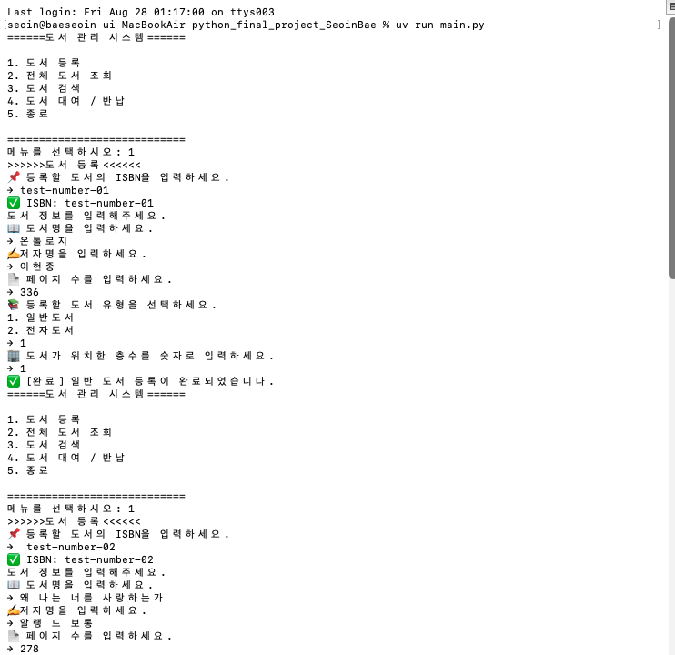

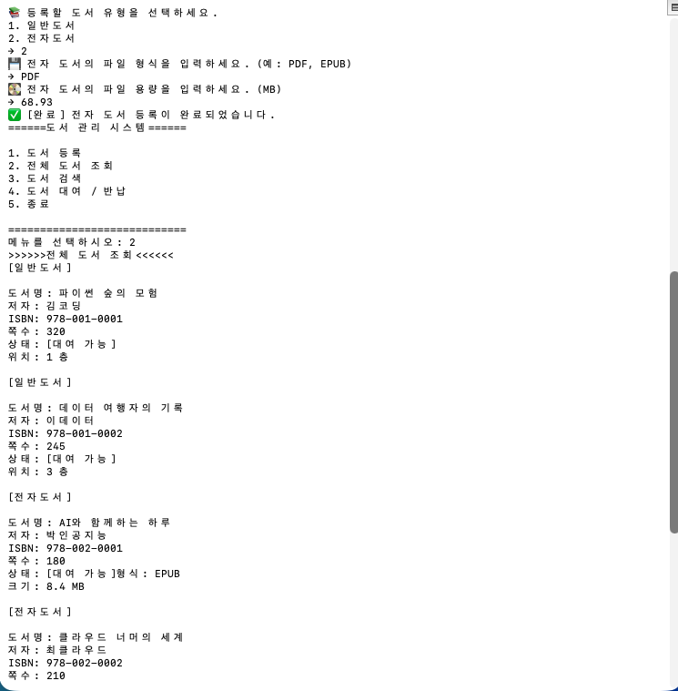

### 3. [도서 검색] 제목, 저자, 식별코드 각각 검색 시도 후 출력 정상 확인

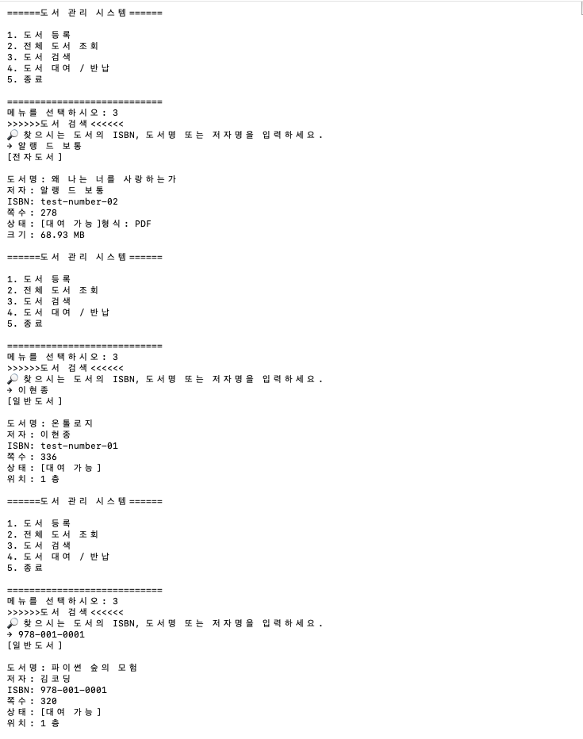

### 4. [도서 대여/반납] 도서 대여와 반납 모두 출력 정상 확인

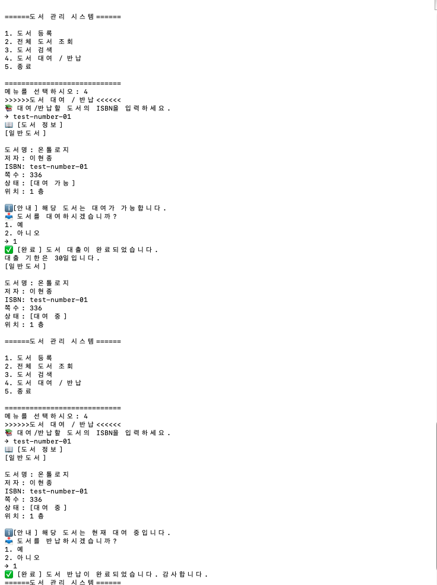

### 5. [종료] 시스템 종료 작동 및 출력 정상 확인

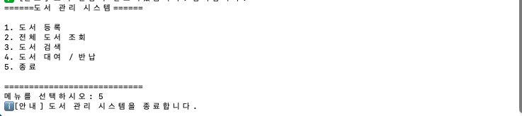

* 윈도우와 맥 환경 모두에서 정상 출력 및 작동됨을 확인함. 
* 제출용 시연 사진은 맥에서 실행시킨 화면임.

---
#### 추가 테스트

1. 기존 ISBN으로 중복 등록 시 정상적으로 차단되는지 ✅

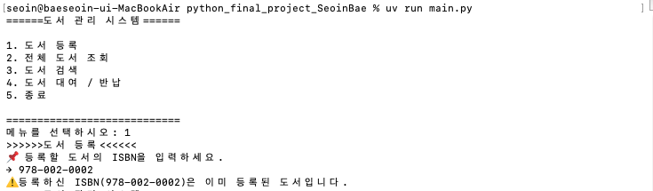

2. 신규 도서 등록 후 즉시 검색되는지 ✅  
   - 기본 시연에서 확인

3. 도서명의 일부 단어만 입력해도 검색되는지 ✅

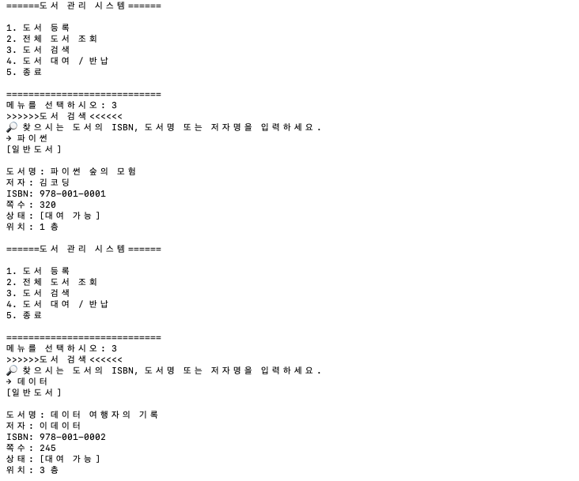

4. 저자명의 일부만 입력해도 검색되는지 ✅

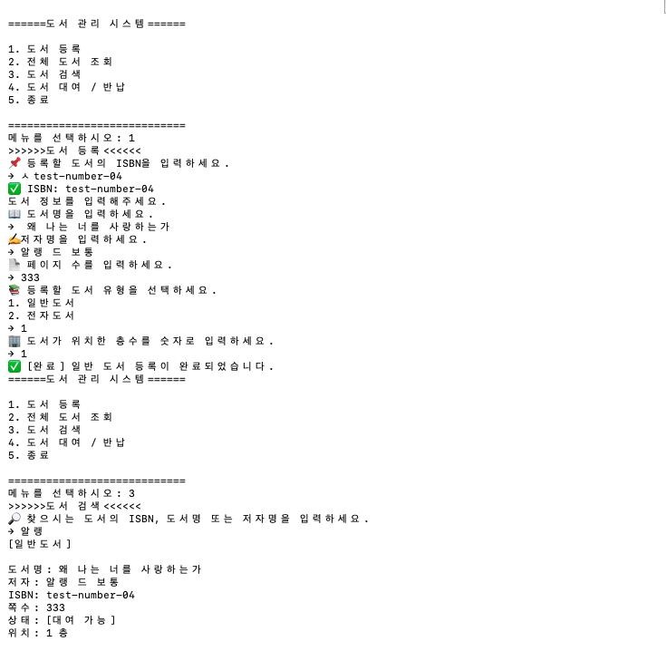

5. 존재하지 않는 ISBN / 제목 / 저자 검색 ✅

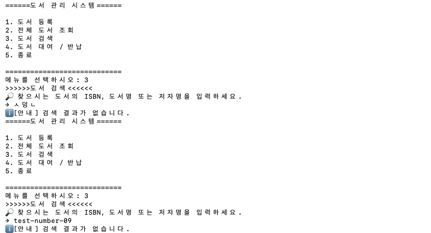

6. 존재하지 않는 ISBN으로 대여/반납 시도 ✅

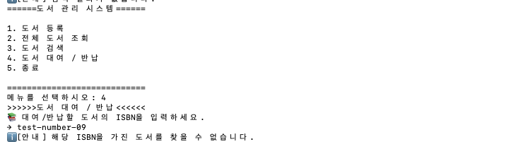

7. 페이지 수에 `300쪽` 등 잘못된 입력 ⚠️ ✅  

- 처리 전

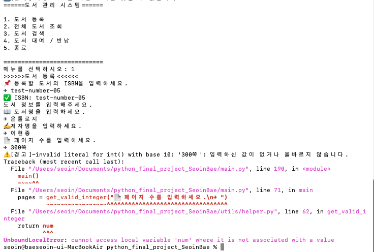

- 처리 후

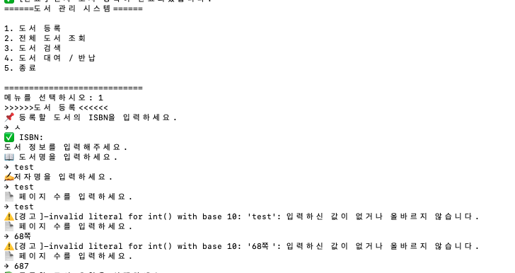

8. 파일 용량에 `50MB` 등 잘못된 입력 ⚠️ ✅ 

- 처리 전

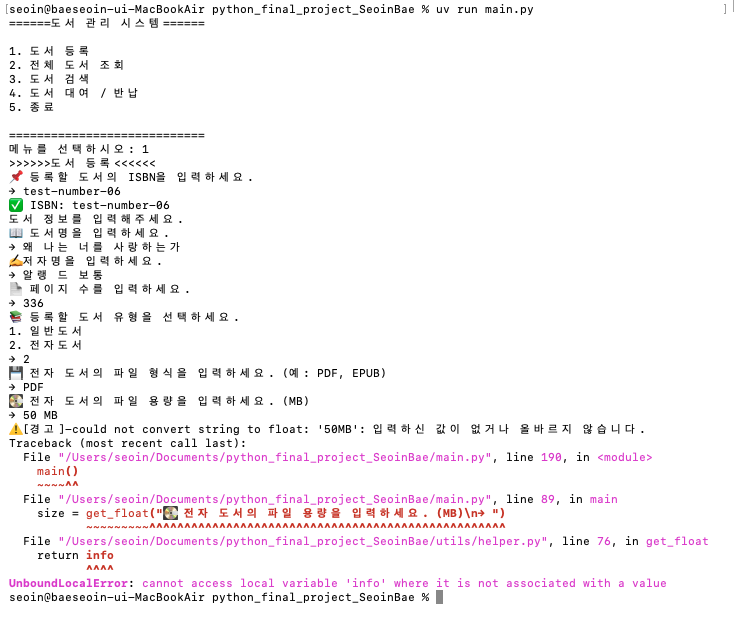

- 처리 후 

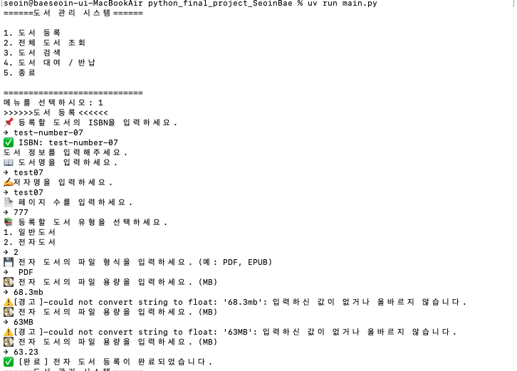

> **잘못된 입력에 대한 문제 해결 과정**  
> 숫자 변환 실패 → `ValueError` 발생 → `except`의 `return`으로 재입력이 불가능하고 미정의 변수를 반환하면서 `UnboundLocalError` 발생 → 경고는 `print()`로 변경하고 정상 입력 시에만 `return`하도록 위치 수정 → 프로그램 종료 없이 반복 재입력 구현

9. 대여 → 전체 조회 → 반납 → 전체 조회 시 상태값 정상 변경 확인 ✅  
   - 기본 시연에서 확인